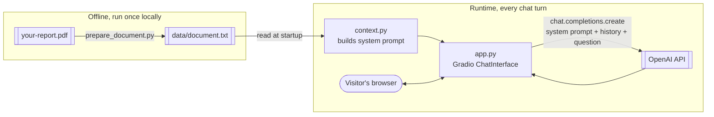

# Investment Ideas Chat

A small AI chat app that lets you ask questions about a PDF report in plain
English, and get answers grounded only in that document.

Built as a portfolio project to demonstrate a working, deployed LLM
application end to end: prompt design, a simple grounding strategy, a web
UI, and a live free-tier deployment — kept deliberately small so the whole
thing fits in your head at once.

**Live demo:** https://investment-ideas-chat.onrender.com/ (first load may
take up to a minute — free tier spins down when idle)
**Stack:** Python, OpenAI API, Gradio, Render

---

## What it does

You give it a PDF (in this instance, ARK Invest's "Big Ideas 2026" report —
swap in any report you like). It extracts the text once, hands the whole
thing to an LLM as context, and exposes a chat box. Ask it things like:

- "What does this report say about robotics?"
- "Summarize the three most bullish predictions in here."
- "Does it mention any risks to the thesis on autonomous ride-hailing?"

Answers are grounded in the document — the system prompt instructs the model
to only use what's in the text, and to say so when something isn't covered,
rather than making things up from general knowledge.

This is not financial advice, and the app says so both in its instructions
to the model and in the UI.

## Why this exists

It's a companion piece to a "digital twin" chat project (same author,
different repo) that answers questions about a person's career using their
LinkedIn profile. This project applies the same idea to a different kind of
document — an investment report — as a second, standalone example of the
pattern: **take a document, make it queryable in natural language, ship it
somewhere anyone can try it.**

## Architecture, in one picture



Two things make this simple on purpose:

1. **No database.** The whole document's text is placed directly into the
   system prompt on every request. No vector store, no retrieval step, no
   embeddings. This works because the report is small enough (~40K tokens)
   to fit comfortably in one prompt alongside the conversation history.
2. **No agent framework.** One function (`chat()` in `app.py`) builds a
   messages list and calls the OpenAI API once per turn. There's no tool use,
   no multi-step reasoning loop, no orchestration library.

See [ARCHITECTURE.md](ARCHITECTURE.md) for the full design rationale,
including why this approach won't scale to larger documents and what you'd
change (retrieval-augmented generation) if it needed to.

## Project structure

```
investment-ideas-chat/
├── app.py                 # Gradio chat app + OpenAI call — the entire runtime
├── context.py              # Loads document text, builds the system prompt
├── prepare_document.py     # One-time PDF → text extraction (run locally)
├── data/
│   └── README.md           # data/document.txt lives here, gitignored
├── requirements.txt
├── .env.example
├── ARCHITECTURE.md          # Design rationale, deeper dive
└── DEPLOY_RENDER.md         # Step-by-step deployment guide
```

## Running it locally

**Prerequisites:** Python 3.10+, an [OpenAI API key](https://platform.openai.com/api-keys).

```bash
git clone <this-repo-url>
cd investment-ideas-chat
pip install -r requirements.txt

cp .env.example .env
# edit .env and paste in your OPENAI_API_KEY

python prepare_document.py path/to/your-report.pdf   # writes data/document.txt

python app.py
```

Gradio will print a local URL (usually `http://127.0.0.1:7860`) — open it and
start chatting.

## Deploying it for free

See [DEPLOY_RENDER.md](DEPLOY_RENDER.md) for the full walkthrough. In short:
push the code (not the PDF or extracted text — see below) to a public GitHub
repo, connect it to [Render](https://render.com)'s free tier, and paste your
document text into Render's "Secret Files" so it never touches GitHub.

## Why the source document isn't in this repo

The code here is public so recruiters and other engineers can read it. The
report itself is someone else's copyrighted content, and "free to download"
isn't the same as "free to redistribute." So `data/*.pdf` and `data/*.txt`
are gitignored — only the code that *processes* a document is public. The
actual document is supplied locally (for development) or via Render's
encrypted Secret Files (for deployment), never committed to git. This also
means you can swap in any report of your own without touching any code.

## Cost

Every chat turn sends the full document (~40K tokens) plus conversation
history to a small OpenAI model (`gpt-5.4-mini` by default). At current mini-model
pricing that's roughly $0.01 or less per exchange — cheap enough for a
low-traffic portfolio demo, but not literally free. Hosting itself (Render's
free web service tier) costs nothing.

## Extending this

Ideas if you want to push it further, roughly in order of effort:

- **Multiple documents** — swap `DOCUMENT_TEXT_PATH` for a small folder of
  texts, and change the system prompt to say which one is which.
- **Retrieval (RAG)** — needed once a document is too large to fit in one
  prompt (see [ARCHITECTURE.md](ARCHITECTURE.md#scaling-past-full-context)
  for what that involves).
- **Tool calls** — e.g. a "record this question I couldn't answer" tool,
  following the same pattern as the companion digital-twin project.

## License

Code in this repository is provided as-is for portfolio/demonstration
purposes. The source document processed by the app is not included and
remains the property of its original publisher.
